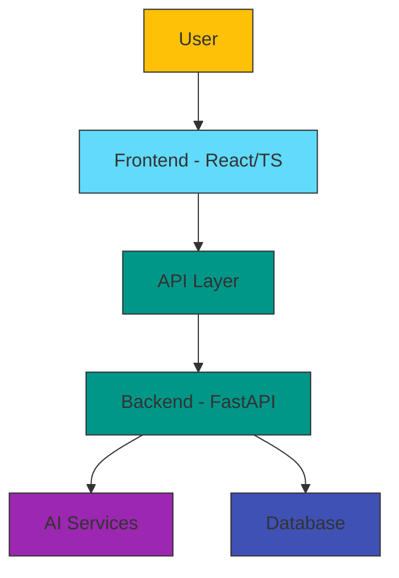

# 🌟 Asha AI - Empowering Women Through Career Guidance

[](https://github.com/koradiaishita/asha-ai-hackathon)
[](https://reactjs.org/)
[](https://fastapi.tiangolo.com/)
[](https://www.typescriptlang.org/)
[](https://mui.com/)
[](https://www.docker.com/)
[](https://opensource.org/licenses/MIT)

## 📋 Project Overview

Asha AI is an innovative career assistant designed specifically for women returning to the workforce, career changers, and job seekers. This AI-powered platform offers personalized guidance, resources, and tools to help women overcome barriers in their professional journey.

> *"Empowering women to build rewarding careers with AI assistance"*

### 🎯 Mission

To create an accessible, personalized AI platform that empowers women to overcome career barriers, develop relevant skills, and confidently navigate their professional journeys.

### 🌟 Key Features

| Feature | Description | Status | Benefits |
|---------|-------------|--------|----------|
| 💬 **AI Chatbot** | Context-aware assistant providing career guidance | ✅ Complete | 24/7 personalized advice |
| 📝 **Resume AI** | Smart resume builder with personalized recommendations | ✅ Complete | Optimized job applications |
| 🚀 **Upskill Navigator** | Custom learning pathways based on career goals | ✅ Complete | Targeted skill development |
| 🎯 **Interview AI** | AI-powered interview preparation and feedback | 🔄 In Progress | Improved interview confidence |
| 👥 **Mentorship** | Connect with industry professionals | 🔄 In Progress | Expert career guidance |
| 📅 **Events** | Access to workshops, webinars, and networking opportunities | 🔄 In Progress | Community support |

## 🏆 Project Impact

Asha AI addresses critical challenges that women face in their career journeys:

- 🔹 **Career Gaps**: Simplifies the return-to-work process after career breaks
- 🔹 **Bias Reduction**: Reduces bias in job application processes
- 🔹 **Skill Development**: Provides personalized skill development recommendations
- 🔹 **Accessibility**: Offers confidential career guidance 24/7
- 🔹 **Community Building**: Creates a supportive community for women professionals

## 🧩 Feature Details

### 📝 Resume AI

The Resume AI module offers comprehensive tools to help women create and optimize professional resumes:

- **ATS Optimization**: Analyze and enhance resumes to pass through Applicant Tracking Systems
- **AI-Powered Recommendations**: Get personalized suggestions for skills and content
- **Template Selection**: Choose from various professional templates
- **Resume Analysis**: Receive detailed feedback on resume structure and content
- **PDF & DOCX Export**: Download resumes in multiple formats

### 🚀 Upskill Navigator

Our Upskill Navigator provides customized learning pathways:

- **Skill Gap Analysis**: Identify skills needed for target roles
- **Course Recommendations**: Curated learning resources
- **Progress Tracking**: Monitor learning journey
- **Career Roadmapping**: Visualize path from current position to career goals

### 🎯 Interview AI

The Interview AI feature helps users prepare for job interviews:

- **Practice Sessions**: Interactive mock interviews with AI feedback
- **Question Bank**: Common and role-specific interview questions
- **Response Analysis**: Feedback on answer quality and delivery
- **Industry Insights**: Tailored advice based on specific companies and roles

### 👥 Mentorship Matching

Connect with industry professionals through:

- **AI-Matched Mentors**: Find mentors based on career goals and background
- **Scheduling Tools**: Book sessions seamlessly
- **Guidance Framework**: Structured mentorship program
- **Feedback System**: Rate and review mentorship experiences

## 💻 Technical Architecture



### 🖥️ Frontend

| Technology | Version | Purpose |
|------------|---------|---------|
| React | 19.0.0 | UI Framework |
| TypeScript | 5.7.2 | Type Safety |
| Material UI | 7.0.1 | Component Library |
| Framer Motion | 12.6.3 | Animations |
| File-Saver | 2.0.5 | Document Export |
| DOCX | 9.3.0 | Resume Generation |
| React Router | 7.5.0 | Routing |
| Vite | 6.2.0 | Build Tool |

### 🔧 Backend

| Technology | Version | Purpose |
|------------|---------|---------|
| FastAPI | 0.100.0 | API Framework |
| Uvicorn | 0.22.0 | ASGI Server |
| Pydantic | 2.0.2 | Data Validation |
| Python-dotenv | 1.0.0 | Environment Variables |
| OpenAI | 1.74.0 | AI Integration |

### 🐳 Docker & Deployment

| Technology | Purpose |
|------------|---------|
| Docker | Containerization |
| Docker Compose | Multi-container orchestration |
| Docker Images | Consistent deployment environments |

## 🚀 Getting Started

### Prerequisites

- Node.js (v18+)
- Python (v3.10+)
- npm or yarn
- Docker and Docker Compose (for containerized setup)

### Installation and Setup

<details>
<summary><b>📱 Frontend Setup</b></summary>

```bash
# Navigate to frontend directory
cd frontend

# Install dependencies
npm install

# Start development server
npm run dev
```

This will start the frontend development server at `http://localhost:3000` (or another port if 3000 is in use).
</details>

<details>
<summary><b>⚙️ Backend Setup</b></summary>

```bash
# Navigate to backend directory
cd backend

# Create virtual environment
python -m venv venv
source venv/bin/activate  # On Windows: venv\Scripts\activate

# Install dependencies
pip install -r requirements.txt

# Start backend server
uvicorn main:app --reload
```

The backend API will be available at `http://localhost:8000`.
</details>

<details>
<summary><b>🐳 Docker Setup (Recommended)</b></summary>

For the easiest setup experience, use Docker Compose:

```bash
# Set your OpenAI API key as an environment variable
export OPENAI_API_KEY=your_api_key_here

# Build and start all services
docker-compose up --build

# Or run in detached mode
docker-compose up -d
```

This will:
1. Build and start the frontend container (accessible at `http://localhost:3000`)
2. Build and start the backend container (accessible at `http://localhost:8000`)
3. Configure networking between the services

To stop the services:
```bash
docker-compose down
```

You can also use a `.env` file in the project root to store your environment variables:
```
OPENAI_API_KEY=your_api_key_here
GITHUB_TOKEN=your_github_token_here
```
</details>

### Environment Variables

The application requires the following environment variables:

| Variable | Purpose | Required |
|----------|---------|----------|
| `OPENAI_API_KEY` | Authentication for OpenAI API | Yes |
| `GITHUB_TOKEN` | For GitHub integration features | No |

## 📂 Project Structure

```
asha-ai-hackathon/
├── docker-compose.yml       # Docker Compose configuration
├── README.md                # Project documentation
├── backend/                 # FastAPI backend service
│   ├── Dockerfile           # Backend container configuration
│   ├── main.py              # Main API entry point
│   └── requirements.txt     # Python dependencies
└── frontend/                # React frontend application
    ├── Dockerfile           # Frontend container configuration
    ├── index.html           # HTML entry point
    ├── package.json         # Node.js dependencies
    └── src/                 # Source code
        ├── App.tsx          # Main application component
        ├── components/      # Reusable UI components
        │   ├── ChatWidget.tsx
        │   └── resume-features/
        ├── data/            # Static data and models
        └── pages/           # Application pages
            ├── ResumeAI.tsx
            ├── SkillUpAI.tsx
            └── ...
```

## 📱 Main Features Implementation

### Resume AI Implementation

The Resume AI feature is built using:
- HTML2Canvas for converting resume previews to images
- jsPDF for generating PDF files
- DOCX.js for creating Word documents
- React state management for dynamic content updates

### AI Integration Points

- Resume optimization and analysis
- Cover letter generation
- Career roadmap creation
- Project idea recommendations
- Interview question generation

## 📸 Screenshots

<div align="center">
  
  <p><i>Asha AI's intuitive user interface</i></p>
</div>

## 🛠️ Development Roadmap

### Current Phase (Q1 2025)
- ✅ Core AI chatbot functionality
- ✅ Resume builder with AI suggestions
- ✅ Skill development pathways
- ✅ Docker containerization

### Next Phase (Q2 2025)
- 📱 Mobile application development
- 🔄 Integration with job portals
- 🧠 Advanced skills assessment
- 🔐 User authentication system
- 🧪 Automated testing suite

### Future Enhancements (Q3-Q4 2025)
- 📊 Career analytics dashboard
- 🌐 Multi-language support
- 🤝 Employer partnerships program
- 🧩 API extensions for third-party integrations
- 📈 Performance optimization

## 💡 Contributing

We welcome contributions to Asha AI! Here's how you can help:

1. Fork the repository
2. Create a feature branch: `git checkout -b feature/amazing-feature`
3. Commit your changes: `git commit -m 'Add amazing feature'`
4. Push to the branch: `git push origin feature/amazing-feature`
5. Open a Pull Request

Please read our [Contributing Guidelines](CONTRIBUTING.md) for details on code style, review process, and more.

## 👩‍💻 Contributors

This project was developed as part of the 2025 Women in Tech Hackathon by:

- Ishita Koradia ([@koradiaishita](https://github.com/koradiaishita))
- [Additional Team Members]

## 🐛 Known Issues

- Docker build may fail with PyTorch CPU variant requirements
- Certain browser extensions can interfere with the voice input feature
- PDF generation may vary slightly between browsers

## 📄 License

This project is licensed under the MIT License - see the [LICENSE](LICENSE) file for details.

---

<div align="center">
  <h3>🌈 Bridging Career Gaps, Building Brighter Futures</h3>
  <p><i>Asha AI - Your AI career partner, every step of the way</i></p>
</div>
